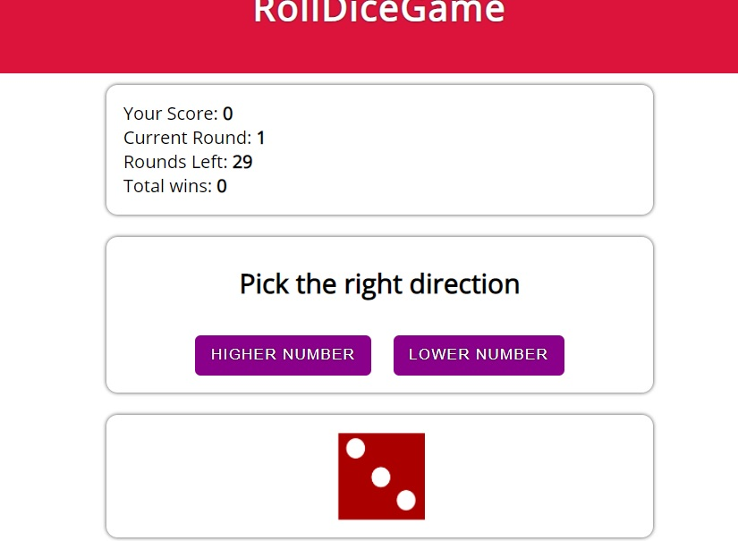

# RollDiceGame

## Demo



## Table of Contents

- [About the Project](#description)
- [How to use](#how-to-use)
- [Technologies used](#built-with)
- [Setup steps](#setup)
- [Sources](#sources)
- [License](#license)

## Description

RollDiceGame uses dicefullApi to get images of the dices and updates its value. You need to guess if the next number on the dice will be lower of higher. There is also a game history saving all rounds. The data is stored in local storage so if you wish to close it and then finish it will ask you to load the previous game if you wish so.

## How to use

Choose one of two buttons and press them in order to guess the dice number.

## Built with

- HTML5
- SCSS
- React
- TypeScript
- Axios
- Dicefull Api

## Setup

```
with BASH

# clone the remote repo to your local one
$ git clone https://github.com/dominiksiejka/RollDiceGame.git

# open the index.html file or use your code editor to open it with live server

```

## Sources

- Icons from [Font Awesome ](https://fontawesome.com)
- Font from [Google Fonts ](https://fonts.google.com/)

## License

- MIT © [Dominik Siejka ](https://github.com/dominiksiejka/RollDiceGame)
